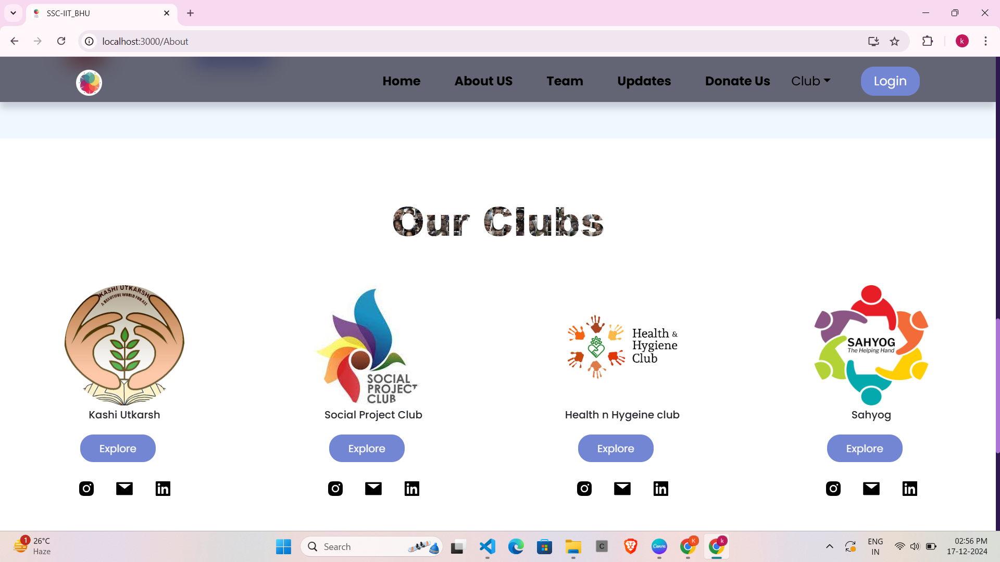

# SSC_IITBHU 
# Live Link :- https://ssc-final-frontend.onrender.com/
We have developed a website that serves as a comprehensive platform for all social activities and events at IIT BHU. This platform not only organizes information about our initiatives but also keeps everyone informed about upcoming events, ongoing projects, and recent achievements. By bringing all our social efforts together in one place, we aim to streamline communication, enhance transparency, and make it easier for students, faculty, and the local community to participate and contribute.

# Features:
- Event Registration: Students can easily register for any social activities or events.
- Donation Page: Individuals can contribute financially according to their capacity to support our initiatives.
- Admin Dashboard: Only the Secretary and Joint Secretary have access to the dashboard, allowing them to update and manage the website content.

# Login credentials :- kapil      -->username 
#                     kapil123   -->password for accessing admin access
# Steps to Clone and Run the Project
# Frontend
- Clone the Repository :- git clone https://github.com/username/repository-name.git
- Navigate to the Project Directory :- cd repository-name
- Install Dependencies :- npm install
- Run the Development Server :- npm start
# Backend
- Navigate to the Project backend Directory :- cd repository-name
- Install Dependencies :- npm install
- Set Up Environment Variables :- Create a .env file in the root directory and configure the required variables as specified in .env. Varaibles are:-

MONGODB_URI=____
STRIPE_PUBLISHABLE_KEY=_____
STRIPE_SECRET_KEY=______

- Run the Development Server :- npm start

# Images:-

# Admin -section:-

.png)
.png)
